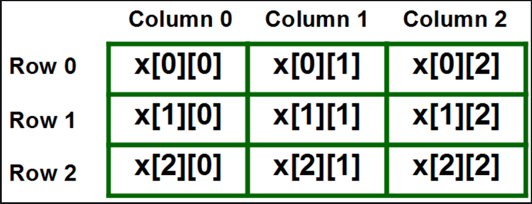

## Data Structure & Algorithm

### Arrays


#### - `1D Array` 
- `Declaration & input`
    ```java
    
    //import Scanner library
    import java.util.Scanner ;

    //creating scanner object
    Scanner input = new Scanner(System.in) ;

    int arr[ ] = new int[10].  
    /*
    Here, size = 10
    Therefore, indices from 0 to 9, i.e. arr[0], arr[1]....arr[9]
    */
    int arr[ ] = {23, 78, 90, 12, 32}. 
    for(int i=0 ; i<arr.length ; i++)
    {
        arr[i] = input.nextInt() ; //input is a Scanner object
    }

    //Accessing ith index
    int ith_value = arr[i] ;

    //print ith element
    System.out.print(ith_value) ;
    ```

- Time Complexity
    > N is total elements
    ##### - `Best Case`
    - `Access` - O(1) 
    - `Search` - O(1)
    - `Insertion` - O(1)
    - `Deletion` - O(1)

    ##### - `Worst Case`
    - `Access` - O(1) 
    - `Search` - O(n)
    - `Insertion` - O(n)
    - `Deletion` - O(n)<br/>


#### - `MultiDimension Array`
> Multidimensional arrays are arrays of arrays with each element of the array holding the reference of other arrays.


<br/>


- `Declaration & input`
    ```java
    int arr[ ][ ] = new int[3][5].  //2DArray with row = 3, col = 5   
    int arr2[ ][ ] = { { 23, 78, 67, 12, 83 },
                      { 10, 65, 89, 23, 87 },
                      { 60, 10, 80, 82, 12 } }. 

    int row = arr.length ;
    int col = arr[0].length ;
    for(int i=0 ; i<row ; i++)
    {
        for(int j=0 ; j<col ; j++)
        {
            arr[i][j] = input.nextInt() ; //input is a Scanner object
        }
    }

    //Accessing ith row & jth col element
    int val = arr[i][j] ;
    ```

- Time Complexity
    - `N` is total elements , `N = rows * cols` 
    - same as 1D
    

> If you want to customize the folder structure, open `.vscode/settings.json` and update the related settings there.

## Dependency Management

The `JAVA PROJECTS` view allows you to manage your dependencies. More details can be found [here](https://github.com/microsoft/vscode-java-dependency#manage-dependencies).


