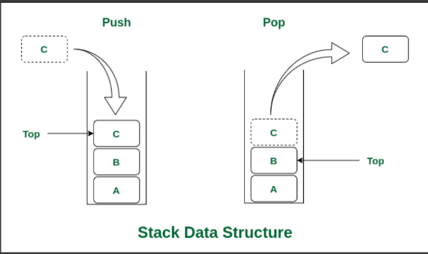

## Data Structure & Algorithm
<br/>

### <u>`Basic and Primitive Data Type`</u>

Data types are divided into two groups:
- `Primitive data types` - includes byte, short, int, long, float, double, boolean and char.
- `Non-primitive data types` - such as String, Arrays and Classes.

Example :-
```Java
int myNum = 5;               // Integer (whole number)
float myFloatNum = 5.99f;    // Floating point number
char myLetter = 'D';         // Character
boolean myBool = true;       // Boolean
String myText = "Hello";     // String
```

Size and Min and Max Value
| DataType |   Size   | Value range  |
| -------- |:--------:| :------------:|
|byte	        |1 byte	| (-2<sup>8</sup> to 2<sup>8</sup>-1)
|short	        |2 bytes	| (-2<sup>15</sup> to 2<sup>15</sup>-1)
|int	|4 bytes	|(-2<sup>31</sup> to 2<sup>31</sup>-1)
|long	|8 bytes	|(-2<sup>63</sup> to 2<sup>63</sup>-1)
|float	|4 bytes	|fractional numbers with 6 to 7 decimal digits
|double	|8 bytes	|fractional numbers with 15 decimal digits
|boolean	|1 bit	|true or false (0 or 1)
|char	|2 bytes	|single char/ ASCII value

### <u>`Basic Java Syntax`</u>

- `For Loop`
    ```Java
    //for(initilization ; condition ; increment or decrement)
    //Example :-
    for(int i=0 ; i<10 ; i++)
    {
        //.....
        //.....
    }
    ```
- `while`
    ```Java
    while(/* condition */ )
    {
        //....
        //.....
    }
    ```
- `Do while`
    ```Java
    do {
    // Code to be executed
    } while (condition);
    ```
- `switch case`
    ```Java
    switch (expression) 
    {
    case value1:
        // Code block executed when expression matches value1
        break; // here break is most imp if not case 2 will also execute along with case 1
    case value2:
        // Code block executed when expression matches value2
        break; //here break is most imp if not next case will also execute along with case 2
    // Add more cases as needed
    default:
        // Code block executed when no case matches the expression
        break;
    }
    ```
- `Escape Sequence`
    - `\t` Insert a Tab
    - `\n` Insert a NewLine
    - `\r` Insert a Carriage.Return (Enter button)
    - `\b` Insert a BackSpace


### <u>`Arrays`</u>


#### - `1D Array` 
- `Declaration & input`
    ```java
    
    //import Scanner library
    import java.util.Scanner ;

    //creating scanner object
    Scanner input = new Scanner(System.in) ;

    int arr[ ] = new int[10].  
    /*
    Here, size = 10
    Therefore, indices from 0 to 9, i.e. arr[0], arr[1]....arr[9]
    */
    int arr[ ] = {23, 78, 90, 12, 32}. 
    for(int i=0 ; i<arr.length ; i++)
    {
        arr[i] = input.nextInt() ; //input is a Scanner object
    }

    //Accessing ith index
    int ith_value = arr[i] ;

    //print ith element
    System.out.print(ith_value) ;
    ```

- Time Complexity
    > N is total elements
    ##### - `Best Case`
    - `Access` - O(1) 
    - `Search` - O(1)
    - `Insertion` - O(1)
    - `Deletion` - O(1)

    ##### - `Worst Case`
    - `Access` - O(1) 
    - `Search` - O(n)
    - `Insertion` - O(n)
    - `Deletion` - O(n)<br/>


#### - `MultiDimension Array`
> Multidimensional arrays are arrays of arrays with each element of the array holding the reference of other arrays.


<br/>


- `Declaration & input`
    ```java
    int arr[ ][ ] = new int[3][5].  //2DArray with row = 3, col = 5   
    int arr2[ ][ ] = { { 23, 78, 67, 12, 83 },
                      { 10, 65, 89, 23, 87 },
                      { 60, 10, 80, 82, 12 } }. 

    int row = arr.length ;
    int col = arr[0].length ;
    for(int i=0 ; i<row ; i++)
    {
        for(int j=0 ; j<col ; j++)
        {
            arr[i][j] = input.nextInt() ; //input is a Scanner object
        }
    }

    //Accessing ith row & jth col element
    int val = arr[i][j] ;
    ```

- Time Complexity
    - `N` is total elements , `N = rows * cols` 
    - same as 1D
    
### <u>`Stack`</u>

Stack is a linear data structure that follows a particular order in which the operations are performed. The order may be LIFO(Last In First Out) or FILO(First In Last Out). LIFO implies that the element that is inserted last, comes out first and FILO implies that the element that is inserted first, comes out last.



- <i><u>Stack using array [Here](https://github.com/hardik-kr/DSA_Progs/blob/master/Stack_Queue/Stack.java)</u></i>
    - Time Complexity

    |Operations|  	Complexity|
    |:---------:|:----------:|
    |push() 	|O(1)|
    |pop()   	|O(1)|
    |isEmpty() 	|O(1)|
    |size()	|O(1)|
- <i><u>Stack using queue [Here](#)</u></i>
    - Time Complexity
    
    |Operations|  	Complexity|
    |:---------:|:----------:|
    |push() 	|O(1) or O(n)|
    |pop()   	|O(n) or O(1)|
    |isEmpty() 	|O(1)|
    |size()	|O(1)|
- <u><i>Stack using LinkedList [Here](#)</u></i>
    - Time Complexity

    |Operations|  	Complexity|
    |:---------:|:----------:|
    |push() 	|O(1)|
    |pop()   	|O(1)|
    |isEmpty() 	|O(1)|
    |size()	|O(1)|